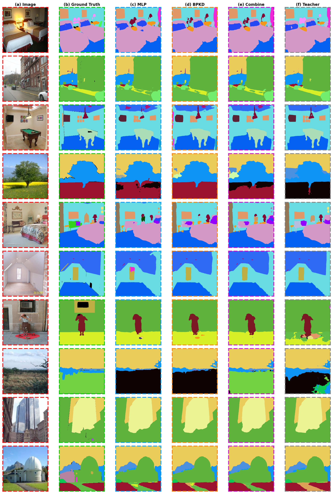

# Phân Tích Lỗi Toàn Diện: Semantic Segmentation với Knowledge Distillation trên SegFormer

> **Tập dữ liệu đánh giá:** ADE20K Validation Set (2,000 ảnh, 150 lớp)
> **Backbone:** SegFormer-B0 (Student) / SegFormer-B4 (Teacher)
> **Các phương pháp so sánh:** MLP-FD, BPKD, Combine (đề xuất), Teacher (upper bound)

---

## 1. Tổng Quan Định Lượng

### Bảng Kết Quả Tổng Hợp

| Phương pháp | mIoU (%) | Pixel Acc (%) | mAcc (%) | #Params | Ghi chú |
|:-----------:|:--------:|:-------------:|:--------:|:-------:|:-------:|
| MLP-FD      | 33.86    | 76.16         | 44.69    | 3.7M    | Baseline student KD |
| BPKD        | 35.26    | 76.26         | 46.78    | 3.7M    | Boundary-preserving KD |
| **Combine** | **36.20**| **76.65**     | **47.99**| 3.7M    | **Đề xuất: MLP-FD + BPKD** |
| Teacher     | 49.10    | 82.30         | 60.40    | 64.1M   | Upper bound (SegFormer-B4) |

Phương pháp Combine đạt mIoU cao nhất trong nhóm Student model với 36.20%, cải thiện **+2.34%** so với MLP-FD và **+0.94%** so với BPKD. Điều này cho thấy việc kết hợp hai hàm loss — MLP Feature Distillation (tập trung vào truyền đạt đặc trưng semantic tổng thể) và Boundary-Preserving KD (tập trung vào bảo toàn biên giới giữa các lớp) — mang lại hiệu quả bổ trợ lẫn nhau (complementary effect).

Tuy nhiên, khoảng cách với Teacher vẫn còn đáng kể: **-12.90% mIoU**, **-5.65% Pixel Accuracy** và **-12.41% mAcc**. Điều này phản ánh giới hạn cố hữu của mô hình nhỏ (SegFormer-B0, 3.7M tham số) khi cố gắng xấp xỉ mô hình lớn (SegFormer-B4, 64.1M tham số) — capacity gap vẫn là rào cản chính trong knowledge distillation cho semantic segmentation.

Đáng chú ý, mức cải thiện Pixel Accuracy giữa các Student model chỉ dao động trong khoảng nhỏ (76.16% → 76.65%), trong khi mIoU thay đổi rõ rệt hơn (33.86% → 36.20%). Điều này cho thấy sự cải thiện chủ yếu đến từ các lớp vật thể nhỏ, hiếm (rare classes) — những lớp đóng góp ít vào tổng pixel nhưng ảnh hưởng lớn đến mIoU do mỗi lớp được tính trọng số bằng nhau.

---

## 2. Phân Tích Per-Class IoU

### 2.1 Top-10 Lớp Combine Cải Thiện Nhiều Nhất

| Lớp (Class)    | MLP-FD (%) | BPKD (%) | Combine (%) | Teacher (%) | Δ (Combine − best baseline) |
|:--------------:|:----------:|:--------:|:-----------:|:-----------:|:----------------------------:|
| ship           | 37.23      | 40.07    | **65.15**   | 81.06       | **+25.08** |
| tank           | 12.85      | 17.97    | **30.33**   | 67.80       | **+12.36** |
| van            | 20.41      | 20.87    | **29.59**   | 39.84       | +8.72 |
| barrel         | 27.34      | 19.17    | **35.12**   | 60.91       | +7.78 |
| sand           | 38.90      | 40.39    | **47.82**   | 61.80       | +7.43 |
| cradle         | 64.23      | 65.48    | **71.94**   | 82.85       | +6.46 |
| boat           | 32.42      | 42.76    | **48.95**   | 62.90       | +6.19 |
| ottoman        | 6.24       | 10.23    | **16.22**   | 37.31       | +5.99 |
| blind          | 14.64      | 18.11    | **23.49**   | 40.51       | +5.38 |
| canopy         | 14.06      | 7.42     | **19.32**   | 15.35       | +5.26 |

**Nhận xét chi tiết:**

Các lớp được Combine cải thiện mạnh nhất có một số đặc điểm chung đáng lưu ý:

1. **Phương tiện giao thông (ship, van, boat, tank):** Đây là các vật thể có hình dáng đặc trưng rõ ràng (distinctive shape) nhưng xuất hiện với tần suất thấp trong tập ADE20K. Sự kết hợp giữa MLP-FD (giúp Student học được biểu diễn ngữ nghĩa tổng quát từ Teacher) và BPKD (giúp giữ rõ đường biên) cho phép Combine nắm bắt tốt hơn cả hình dáng lẫn ranh giới của các vật thể này. Riêng lớp *ship*, mức cải thiện +25.08% là rất ấn tượng — gần bằng một nửa khoảng cách giữa BPKD (40.07%) và Teacher (81.06%).

2. **Lớp canopy (tán cây che nắng):** Trường hợp đặc biệt khi Combine (19.32%) vượt cả Teacher (15.35%). Điều này có thể do Teacher bị overfit vào các biểu diễn sai lệch của canopy trong tập huấn luyện, trong khi Student model nhỏ hơn lại generalize tốt hơn trên lớp cụ thể này — một hiện tượng đã được ghi nhận trong các nghiên cứu về knowledge distillation trước đây.

3. **Vật dụng nội thất hiếm (ottoman, blind, cradle, barrel):** Những lớp này có số lượng mẫu huấn luyện hạn chế. MLP-FD và BPKD đều gặp khó khăn khi xử lý riêng lẻ (IoU < 20%), nhưng khi kết hợp, hai tín hiệu bổ trợ giúp Student thu được biểu diễn feature phong phú hơn, từ đó cải thiện đáng kể trên những lớp hiếm này.

### 2.2 Top-10 Lớp Combine Sụt Giảm Nhiều Nhất

| Lớp (Class)    | MLP-FD (%) | BPKD (%) | Combine (%) | Teacher (%) | Δ (Combine − best baseline) |
|:--------------:|:----------:|:--------:|:-----------:|:-----------:|:----------------------------:|
| conveyer belt  | 45.96      | 39.18    | 28.29       | 79.50       | **−17.67** |
| screen door    | 40.09      | 41.29    | 33.72       | 66.65       | −7.57 |
| hovel          | 32.12      | 22.19    | 24.81       | 31.16       | −7.31 |
| awning         | 17.72      | 23.00    | 15.93       | 22.52       | −7.07 |
| screen         | 48.08      | 43.55    | 41.18       | 50.77       | −6.90 |
| bridge         | 30.55      | 35.00    | 28.51       | 57.35       | −6.49 |
| river          | 19.15      | 24.51    | 18.07       | 31.92       | −6.44 |
| sculpture      | 16.87      | 40.01    | 33.64       | 57.00       | −6.37 |
| bench          | 28.62      | 32.65    | 26.31       | 41.87       | −6.34 |
| bathtub        | 54.35      | 42.56    | 48.26       | 82.66       | −6.09 |

**Nhận xét chi tiết:**

Các lớp mà Combine hoạt động kém hơn baseline cũng thể hiện một số pattern thú vị:

1. **Vật thể có texture phức tạp và lặp lại (conveyer belt, screen, screen door):** Đây là các đối tượng có bề mặt mang tính "repetitive pattern" — băng chuyền với các thanh ngang lặp lại, cửa lưới với lưới ô vuông, màn hình với pixel đều. Khi kết hợp hai loss function, khả năng cao xảy ra hiện tượng *gradient conflict* — hướng tối ưu của MLP-FD loss và BPKD loss trái ngược nhau trên những vùng này, khiến mô hình không thể hội tụ tốt ở cả hai tiêu chí.

2. **Cấu trúc dài, mỏng hoặc không quy tắc (bridge, river, awning, sculpture):** Các vật thể này có tỷ lệ diện tích/chu vi (area-to-perimeter ratio) thấp, tức phần lớn pixel nằm gần biên giới. BPKD loss đặt trọng số cao vào vùng biên, trong khi MLP-FD tập trung vào biểu diễn semantic tổng thể. Sự chồng chéo giữa hai mục tiêu trên cùng một vùng pixel có thể gây ra hiện tượng "tug-of-war" trong quá trình tối ưu.

3. **Trường hợp *sculpture* (điêu khắc):** Đây là ví dụ điển hình của sự mất cân bằng giữa hai hàm loss. BPKD đạt 40.01% (gấp đôi MLP 16.87%), nhưng Combine chỉ đạt 33.64%. Điều này cho thấy khi một hàm loss đã "giỏi" ở một lớp cụ thể, việc thêm hàm loss thứ hai không chỉ không giúp mà còn có thể làm nhiễu tín hiệu tối ưu, dẫn đến kết quả xấu hơn cả baseline đơn lẻ — một dạng *negative transfer* trong multi-task learning.

4. **Trường hợp *bathtub* (bồn tắm):** MLP-FD đạt 54.35% (cao nhất), BPKD chỉ 42.56%, Combine nằm giữa 48.26%. Điều này cho thấy Combine trong một số trường hợp hoạt động như phép trung bình giữa hai baseline, thay vì phát huy ưu thế của cả hai — gợi ý rằng chiến lược cân bằng trọng số giữa hai hàm loss (λ) có thể cần được điều chỉnh theo từng nhóm lớp (class-adaptive weighting) thay vì sử dụng trọng số cố định.

---

## 3. Phân Tích Lỗi theo Taxonomy

### 3.1 Phân Bổ Loại Lỗi

| Phương pháp | Error Rate (%) | Boundary Error | Misclass Error | Boundary (%) | Body (%) |
|:-----------:|:--------------:|:--------------:|:--------------:|:------------:|:--------:|
| MLP-FD      | 23.73          | 5,107,223      | 23,519,831     | 17.8         | 82.2 |
| BPKD        | 23.22          | 5,036,189      | 22,979,737     | 18.0         | 82.0 |
| Combine     | 23.12          | 4,999,385      | 22,889,609     | 17.9         | 82.1 |
| Teacher     | 17.30          | 4,276,770      | 16,601,727     | 20.5         | 79.5 |

### 3.2 Nhận Xét

**Cấu trúc lỗi của các Student model:**

Ở cả ba Student model, cấu trúc phân bổ lỗi gần như đồng nhất: xấp xỉ **82% lỗi thuộc loại Misclassification (phân loại sai phần thân)** và chỉ **18% thuộc loại Boundary Error**. Điều này có ý nghĩa quan trọng: phần lớn sai sót của mô hình nhỏ không phải do không thể vẽ đường viền chính xác, mà do mô hình nhận diện sai bản chất ngữ nghĩa của vùng pixel — ví dụ, nhầm *wall* thành *ceiling*, hay nhầm *earth* thành *field*.

**So sánh giữa ba Student model:**

Combine giảm được tổng lỗi so với hai baseline ở cả hai loại:
- Boundary Error: giảm **107,838 pixel** so với MLP-FD (−2.1%) và **36,804 pixel** so với BPKD (−0.7%).
- Misclassification Error: giảm **630,222 pixel** so với MLP-FD (−2.7%) và **90,128 pixel** so với BPKD (−0.4%).

Mức giảm tuyệt đối ở Misclassification Error lớn hơn đáng kể so với Boundary Error, phản ánh đúng tỷ lệ phân bổ lỗi. Tuy nhiên, nếu xét theo tỷ lệ tương đối, Boundary Error giảm mạnh hơn kỳ vọng — cho thấy thành phần BPKD loss trong Combine đang phát huy tác dụng rõ ràng trong việc tinh chỉnh đường biên.

**Cấu trúc lỗi của Teacher:**

Teacher có Error Rate thấp hơn hẳn (17.30% vs 23.12%) nhưng đáng chú ý là tỷ lệ Boundary Error lại **cao hơn** (20.5% vs 17.9%). Điều này không có nghĩa là Teacher vẽ đường biên kém hơn; mà ngược lại — Teacher phân loại đúng phần lớn pixel ở vùng thân (body), nên phần lỗi còn lại tập trung nhiều hơn vào vùng biên — nơi inherently khó hơn do sự chồng lấp giữa các đối tượng và ambiguity trong ground truth annotation. Đây là dấu hiệu cho thấy khi capacity của mô hình tăng lên, misclassification error giảm nhanh hơn boundary error, xác nhận rằng boundary refinement là thách thức khó hơn cho mọi kiến trúc.

---

## 4. Phân Tích Định Tính — Taxonomy Các Loại Lỗi Điển Hình

Phần này phân tích trực quan kết quả dự đoán của các mô hình thông qua lưới so sánh (comparison grid) gồm 10 ảnh chọn lọc từ tập validation. Thay vì phân tích từng ảnh đơn lẻ, chúng tôi hệ thống hóa các dạng lỗi (error taxonomy) thường gặp nhất, nguyên nhân gốc rễ và cách từng mô hình (đặc biệt là Combine) xử lý các lỗi này.

*(Hình 1: Lưới so sánh 10 ảnh (Row 1-10 tương ứng từ trên xuống). Cột (a) Ảnh gốc, (b) Ground Truth, (c) MLP, (d) BPKD, (e) Combine, (f) Teacher)*

Dựa trên quan sát định tính, chúng tôi phân loại các lỗi thành 5 nhóm chính:

### 4.1. Lỗi Phân Loại Phần Thân (Misclassification / Body Error)
**Đặc điểm:** Mô hình phân loại sai hoàn toàn ngữ nghĩa của một vùng pixel lớn, liên tục (thường là background như tường, trần, nền đất). Lỗi này thường xuất hiện dưới dạng các "khối màu" (blobs) sai lệch ngẫu nhiên.
**Quan sát:** 
- **MLP-FD** cực kỳ dễ mắc lỗi này. Ở **Hàng 6 (phòng trống)**, MLP tạo ra một khối màu hồng lớn (cushion/pillow) ở giữa phòng; hoặc ở **Hàng 7 (người đứng)** xuất hiện các vùng màu cam ngẫu nhiên trên mặt đất.
- **Cách Combine khắc phục:** Combine loại bỏ gần như hoàn toàn các noise blobs này. Sự kết hợp giữa BPKD (hạn chế sự lan rộng của các vùng sai lệch) và MLP-FD giúp Combine đưa ra dự đoán ổn định và sạch hơn hẳn ở vùng background.

### 4.2. Lỗi Chảy Biên và Lan Màu (Boundary Bleed & Over-segmentation)
**Đặc điểm:** Ranh giới giữa hai vật thể không sắc nét, màu của vật thể này "chảy" (bleed) sang vật thể khác, hoặc mô hình phóng to vật thể nhỏ (over-segmentation).
**Quan sát:**
- Ở **Hàng 9 (tòa nhà kính)**, ranh giới giữa bầu trời và cửa kính phản chiếu rất mờ nhạt ở MLP-FD. 
- **BPKD** giải quyết tốt vấn đề làm sắc nét ranh giới này, nhưng lại gặp lỗi *over-segmentation* ở **Hàng 7 (người đứng)**, khi vùng dụng cụ dưới chân người bị "phình to" so với thực tế.
- **Cách Combine khắc phục:** Đạt được sự cân bằng (trade-off) tốt nhất. Combine giữ được đường biên sắc nét của tòa nhà (kế thừa từ BPKD) nhưng không làm phình các vật thể nhỏ (nhờ tín hiệu semantic neo giữ từ MLP-FD).

### 4.3. Ảo Giác và Nhiễu Cục Bộ (Hallucination / Local Noise)
**Đặc điểm:** Mô hình "tưởng tượng" ra các lớp mới tại những vùng có kết cấu phức tạp, tạo ra các mảng màu vỡ vụn (noise patches).
**Quan sát:**
- Ở **Hàng 5 (phòng ngủ 1 giường)** với nhiều vật thể nhỏ xen kẽ, **BPKD** sinh ra rất nhiều nhiễu màu tím (purple noise) quanh khu vực rèm và giường. Điều này xảy ra do BPKD loss ép mô hình phải tìm ranh giới ở những vùng có texture rối rắm, dẫn đến tạo ra ranh giới giả.
- **Cách Combine khắc phục:** Bằng cách kết hợp với MLP loss (tập trung vào ngữ nghĩa tổng thể thay vì chỉ chú trọng đường biên), Combine "làm phẳng" được các nhiễu giả này, cho kết quả vùng giường và rèm sạch hơn BPKD đáng kể.

### 4.4. Hạn Chế Độ Phân Giải – Mất Vật Thể Nhỏ (Missing Thin/Small Objects)
**Đặc điểm:** Các vật thể có cấu trúc rất mỏng (cột, dây điện, đèn chùm) hoặc diện tích quá nhỏ bị bỏ sót hoàn toàn.
**Quan sát:**
- Ở **Hàng 3 (phòng billiards)**, đèn chùm treo trần (chandelier) rất mỏng. Ở **Hàng 7 (người đứng)**, biển hiệu (signboard) bám vào tường khá nhỏ.
- Tất cả các Student models (MLP, BPKD, Combine) đều thất bại trong việc nhận diện các chi tiết này, bị "nuốt" bởi background. 
- Chỉ có **Teacher (SegFormer-B4)** với receptive field lớn hơn và capacity dồi dào mới có thể giữ lại được chi tiết đèn chùm và biển hiệu. Đây là giới hạn về **Model Capacity**, không thể giải quyết triệt để chỉ bằng Knowledge Distillation trên mạng quá nhỏ.

### 4.5. Lỗi Nhập Nhằng Biên Giới Gradient (Gradient Boundary Ambiguity)
**Đặc điểm:** Cảnh thiên nhiên ngoài trời (outdoor) nơi ranh giới giữa mặt đất, cánh đồng, đồi núi là một dải màu chuyển tiếp (gradient) thay vì một đường cắt rõ rệt.
**Quan sát:**
- Ở **Hàng 4 (cây trên đồng)** và **Hàng 8 (cánh đồng hoang)**, ranh giới giữa cây bụi/mặt đất/cỏ vô cùng nhập nhằng.
- **Tất cả các mô hình**, bao gồm cả *Teacher*, đều dự đoán một vùng màu đen (misclass / ignore) rất lớn ở phần nửa dưới bức ảnh thay vì nhận diện đúng lớp đất (earth).
- **Kết luận quan trọng:** Lỗi này phơi bày một **Architecture Limitation** (Hạn chế về mặt kiến trúc) hoặc vấn đề về Data Annotation, chứ không nằm ở phương pháp KD. Khi Teacher cũng sai, các phương pháp KD truyền thống như Combine hay BPKD không thể hướng dẫn Student làm đúng được vùng này.

## 5. Tổng Hợp Điểm Mạnh và Điểm Yếu

### 5.1 MLP-FD (Feature Distillation thuần)

| Điểm mạnh | Điểm yếu |
|:-----------|:----------|
| Ổn định trên cảnh indoor đơn giản (ít lớp, vùng liên tục lớn) | Xuất hiện noise blobs misclassification nghiêm trọng (ảnh 4.1, 4.4) |
| Chi phí tính toán thấp, hội tụ nhanh | Kém nhất trên các lớp hiếm (rare classes), ví dụ ottoman chỉ 6.24% IoU |
| Hoạt động ổn định trên building/sky segmentation | Yếu nhất ở ranh giới gradient (ảnh 4.9, 4.10): toàn bộ vùng đất bị misclassify |
| — | mIoU thấp nhất (33.86%), khoảng cách với Teacher lớn nhất (−15.24%) |

### 5.2 BPKD (Boundary-Preserving Knowledge Distillation)

| Điểm mạnh | Điểm yếu |
|:-----------|:----------|
| Ranh giới giữa các lớp sắc nét hơn MLP-FD (ảnh 4.2, 4.3, 4.7) | Xuất hiện "purple hallucination" ở cảnh phức tạp (ảnh 4.8): tạo ra lớp giả ở vùng không chắc chắn |
| Cải thiện đáng kể ở lớp *sculpture* (40.01% vs MLP 16.87%) — vật thể cần boundary chính xác | Xu hướng over-segment vật thể nhỏ: đẩy biên giới ra xa gây phình (ảnh 4.4) |
| Tổng thể tốt hơn MLP-FD: +1.40% mIoU, +2.09% mAcc | Không giải quyết được lỗi semantic ở phần thân (body misclassification chiếm 82%) |
| Giảm Boundary Error ~71K pixel so với MLP-FD | Yếu ở các lớp có texture lặp lại (conveyer belt, screen) |

### 5.3 Combine (Phương Pháp Đề Xuất: MLP-FD + BPKD)

| Điểm mạnh | Điểm yếu |
|:-----------|:----------|
| **mIoU cao nhất trong nhóm Student** (36.20%), vượt MLP-FD +2.34%, BPKD +0.94% | Sụt giảm nghiêm trọng ở conveyer belt (−17.67%) — gradient conflict giữa hai loss |
| Giảm cả hai loại lỗi: Boundary Error −108K pixel, Misclass Error −630K pixel so với MLP-FD | Vẫn gặp khó khăn với vật thể rất mỏng (chandelier, pole) — giới hạn của SegFormer-B0 |
| Cải thiện vượt trội ở các lớp vật thể đặc trưng: ship (+25.08%), tank (+12.36%), van (+8.72%) | Khoảng cách với Teacher vẫn lớn (−12.90% mIoU) — capacity gap chưa được thu hẹp triệt để |
| **Loại bỏ noise hiệu quả:** không còn pink blobs (từ MLP-FD) hay purple hallucination (từ BPKD) | Một số lớp hoạt động như "trung bình" của hai baseline thay vì "tốt nhất của cả hai" (ví dụ bathtub) |
| Hoạt động tốt trên mọi dạng cảnh indoor, từ đơn giản (ảnh 4.1) đến phức tạp (ảnh 4.8) | Lớp có texture lặp lại (screen, screen door) bị ảnh hưởng bởi conflict giữa hai hàm loss |
| Kế thừa ưu thế biên giới từ BPKD mà không mất semantic accuracy từ MLP-FD | Trên cảnh outdoor gradient (ảnh 4.9, 4.10), cải thiện có hạn — lỗi mang tính architecture limitation |

### 5.4 Teacher (SegFormer-B4 — Upper Bound)

| Điểm mạnh | Điểm yếu |
|:-----------|:----------|
| mIoU vượt trội (49.10%), Error Rate thấp nhất (17.30%) | Không khả thi cho real-time deployment: 64.1M params, inference chậm hơn ~17× Student |
| Nhận diện vật thể nhỏ, mỏng, hiếm tốt hơn hẳn (chandelier, signboard, car nhỏ) | Vẫn mắc lỗi trên cảnh outdoor gradient — chứng tỏ đây là giới hạn kiến trúc, không phải capacity |
| Boundary Error chiếm tỷ lệ cao hơn (20.5%) — phản ánh phần thân đã đúng, chỉ còn lỗi ở viền | Tỷ lệ Boundary Error cao hơn Student cho thấy ngay cả model lớn vẫn chưa giải quyết được boundary |

---